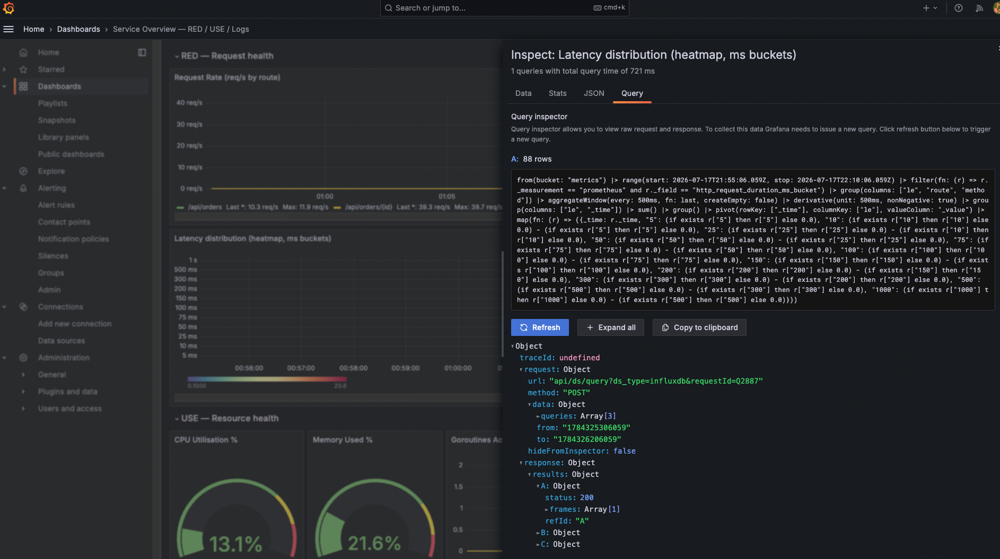
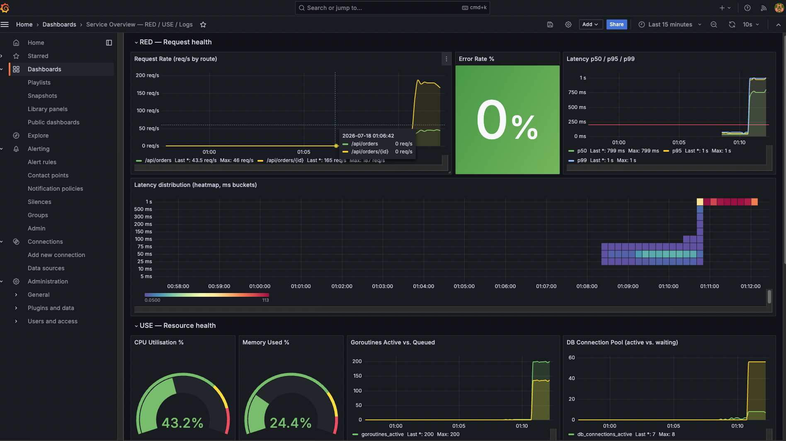
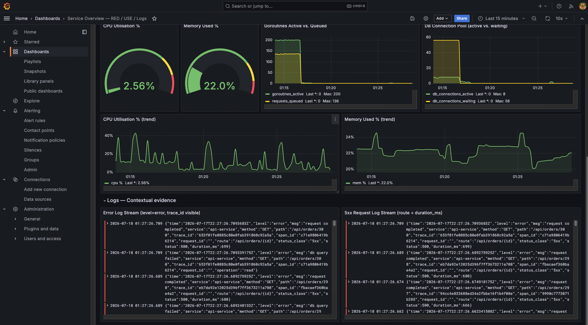

# Lab 2-1 — Production Observability Stack (TIG + Loki + Grafana)

## 1. Environment

**Machine / toolchain**

| | |
|---|---|
| OS | macOS 15.3.1 (Darwin 24.3.0, arm64) |
| CPU | Apple M1 Pro — 8 cores |
| Memory | 32 GB |
| Docker | 20.10.17 |
| Docker Compose | v2.10.2 |
| Go | 1.25.3 (module targets Go 1.23) |

The whole stack runs with a single `docker compose up --build -d` — InfluxDB, Telegraf,
Loki, Promtail, Grafana, and the instrumented service. No manual steps are needed
afterwards: datasources, dashboard, and alert rules are all provisioned from files.

**Service under observation**

A small Go API (`service/`) that pretends to be an "orders" service. It is the system
we watch; everything else is the observability plumbing.

Ports:
- `:8080` (published on host **`:18080`**) — the application API
- `:9090` — the Prometheus `/metrics` endpoint that Telegraf scrapes

Endpoints:

| Method + path | What it does |
|---|---|
| `GET /api/orders/{id}` | Simulated DB read |
| `GET /api/orders` | Simulated DB list |
| `POST /api/orders` | Simulated DB write |
| `GET /healthz` | Liveness check (excluded from RED metrics) |
| `POST /admin/inject` | Runtime knob to inject faults (error ratio, extra latency) |
| `GET /metrics` (on `:9090`) | RED + USE metrics in Prometheus format |

**Simulated behaviour (how load turns into signals)**

Each request has to borrow two bounded resources, which is what makes the service
saturate under load in a realistic way:

1. **Worker pool** (`MAX_WORKERS`, default 64) — the app's concurrency limit. Requests
   waiting for a free worker are counted by `requests_queued` (saturation).
2. **DB connection pool** (`DB_POOL_SIZE`, default 8) — each request then borrows a
   "connection", holds it for a ~20–50 ms simulated query, and releases it. Requests
   waiting for a connection are counted by `db_connections_waiting` (saturation); if the
   wait exceeds the acquire timeout (`DB_ACQUIRE_TIMEOUT_MS`, default 500 ms) the request
   returns `503` (a 5xx error).

So under normal load everything is fast and error-free; once offered load exceeds the
pool's capacity (~150–230 req/s) requests start queuing, latency climbs, waiters rise,
and eventually some requests time out with 5xx. The service also emits one structured
JSON log line per request (with `trace_id`, `route`, `status`, `duration_ms`, `level`).

## 2. Stack Verification

Each layer of the stack was confirmed to be working end to end.

All screenshots can be found in the `screenshots/` directory.

**Metrics — InfluxDB is receiving data**

Telegraf scrapes the service `/metrics` endpoint every 10s and writes into the `metrics`
bucket. Querying InfluxDB shows the app metrics arriving (measurement `prometheus`, one
field per metric name) alongside the system metrics (`cpu`, `mem`).



**Dashboards — Grafana loads the provisioned dashboard**

Grafana comes up with the InfluxDB + Loki datasources and the "Service Overview" dashboard
already provisioned from files (no manual setup). All panels render and populate.



**Logs — Loki has the service logs, queryable by level**

Promtail tails the service's JSON log file and ships it to Loki. Logs are queryable by
`service` and by `level`:

```logql
{service="api-service"}                       # all lines for the service
{service="api-service", level="error"}        # only error lines
{service="api-service"} | json | status >= 500  # 5xx requests (route + duration_ms)
```

A 5-minute window after a short load run returned well over 10 lines — e.g. **1284 `info`
+ 134 `error`** — each carrying `trace_id`, `route`, `status`, and `duration_ms`:



> **Note on log volume.** The service log is a single append-only file on a shared volume.
> Heavy/repeated load runs can grow it large; if Promtail ever re-reads a big backlog it can
> briefly hit Loki's ingestion rate limit (HTTP 429) and drop lines. This is mitigated by
> (a) persisting Promtail's read position on a volume so restarts don't re-read the file,
> and (b) raised Loki ingestion limits. To reset between runs: `docker compose down -v`.

## 3. RED Metrics Analysis

Numbers are from one full run of `load-test/load_test.py` (client-measured), which drives
four phases: Warm-up → Nominal → Saturation → Recovery.

| Phase       | Avg RPS | Error Rate % | p50 (ms) | p95 (ms) | p99 (ms) |
|-------------|---------|--------------|----------|----------|----------|
| Warm-up     | 10.0    | 0.0          | 49.8     | 71.6     | 84.7     |
| Nominal     | 49.9    | 0.0          | 44.3     | 64.5     | 79.6     |
| Saturation  | 222.0   | 0.0          | 895.1    | 947.0    | 1051.8   |
| Recovery    | 50.0    | 0.0          | 45.4     | 64.7     | 73.9     |

**What the numbers say**

- **Warm-up / Nominal** — the service is well below capacity. Latency is flat (~45 ms p50,
  ~80 ms p99) and there are zero errors. This is the healthy baseline.
- **Saturation** — offered load (400 rps) exceeds capacity, so throughput plateaus at
  ~222 rps (the connection pool's ceiling) and **latency jumps ~20×** (p50 45 → 895 ms,
  p99 80 → 1052 ms). Requests pile up waiting for a worker and a DB connection. Notably the
  **error rate stays ~0%**. (Avg RPS here is *completed* throughput over actual elapsed time,
  not the offered 400 rps — see the Little's Law note in section 4.)
- **Recovery** — once load drops back to 50 rps, latency returns to the ~45 ms baseline
  almost immediately. No lingering damage.

**Key takeaway.** This service degrades under overload by getting *slow*, not by *failing* —
it queues work instead of rejecting it, so overload shows up as latency, not 5xx. That is
why an error-rate alert alone would miss this kind of saturation, and why we also alert on
the resource itself (`db_connections_waiting`, see section 5). The latency signal (p95/p99)
and the USE signals are what actually catch this failure mode.

## 4. USE Metrics Analysis

Peak values observed during the Saturation phase (from InfluxDB):

| Metric | Peak | Meaning |
|---|---|---|
| `requests_queued` | 136 | requests waiting for a worker slot |
| `goroutines_active` | 200 | requests in flight in the server |
| `db_connections_active` | 8 | = pool size → **pool fully exhausted** |
| `db_connections_waiting` | 56 | requests waiting for a DB connection |
| `cpu usage_active` | ~45% | CPU was never the limit |

**At what CPU % did saturation begin?**
`requests_queued` first went above 0 while CPU was only **~11%**, and even at the peak of
the saturation phase CPU stayed around **45%**. So saturation began nowhere near CPU
exhaustion — CPU is not the bottleneck.

**Did the DB connection pool exhaust? At what load?**
Yes. `db_connections_active` pinned at **8** (the whole pool) and `db_connections_waiting`
rose to **56**. This happened once offered load passed the pool's throughput ceiling of
~**220–230 req/s** (8 connections × ~35 ms per query). The Nominal phase (50 rps) never
touched it; the Saturation phase (400 rps offered) exhausted it immediately. The scarce
resource is the **connection pool**, not CPU.

**Little's Law check — L = λ × W**

Using the saturation throughput (222 req/s) and p95 latency (0.947 s):

```
L = 222 req/s × 0.947 s ≈ 210  ≈  goroutines_active (200)   ✓
```

(Using the median latency 0.895 s instead of the p95 tail gives 222 × 0.895 ≈ 199 — essentially
exact.) It is also internally consistent: `goroutines_active` = `requests_queued` (136) + busy
workers (64) = **200**, which is exactly the load generator's concurrency cap (200 connections),
so the server can hold at most ~200 requests in flight.

The subtle part is measuring λ correctly. The **222 req/s** is *completed* throughput over the
actual elapsed time. A naive load generator that divides by the configured phase duration would
report ~370 req/s — but under overload a backlog keeps draining after the window closes, so that
number counts work only *queued*, not completed, and would break the Little's Law match
(370 × 0.947 ≈ 350 ≠ 200). The load test measures elapsed time to avoid this. Lesson: measure
throughput and concurrency at the **same place**.

## 5. Log-to-Metric Correlation

One 5xx error log line picked from the Loki panel during a saturating run (high concurrency
with a degraded downstream). Its `duration_ms` of 570 ms is saturation-level latency, so this
request queued and waited before it failed — not a fast reject.

```json
{
  "time": "2026-07-17T23:09:27.094580842Z",
  "level": "error",
  "msg": "request completed",
  "service": "api-service",
  "method": "GET",
  "path": "/api/orders/12631",
  "trace_id": "6798eb990166151dabd81f1cb95a1740",
  "span_id": "21c5b399b7ef3e5e",
  "route": "/api/orders/{id}",
  "status_class": "5xx",
  "status": 500,
  "duration_ms": 570
}
```

Filtering Loki by that `trace_id` returns a **second** line from the same request, written
2 ms earlier — the resource-level cause:

```
23:09:27.092  level=error  msg="db query failed"  operation=read
23:09:27.094  level=error  msg="request completed" status=500  duration_ms=570
```

**What the log tells you that the metric alone does not.**
The metric (`http_errors_total` / the Error Rate % panel) only says *"5xx rate is up to ~20%"* —
an aggregate number with no explanation. The log line adds the detail you actually need to
act:

- **Which** request failed — `trace_id 6798…`, on route `/api/orders/{id}`, method `GET`
  (the specific instance, not just a rate).
- **How it failed** — `duration_ms: 570`, i.e. it spent saturation-level time in the system
  *before* failing, so this is an overload-related failure, not an instant reject.
- **Why** it failed — filtering by `trace_id` shows the correlated `"db query failed"
  (operation=read)` line, so the root cause is the **downstream DB read**, not a connection
  pool timeout or a bad request.

That is the whole point of the single pane of glass: the metric tells you *that* something is
wrong and roughly how much; the log, joined by `trace_id`, tells you *which* request, *how*,
and *why* — enough to open the runbook on the right component.

## 6. Alert Evidence

The **DB Connection Pool Saturated** rule fired from pure saturation load (no injection).
Condensed from `grafana/provisioning/alerting/alerts.yml`:

```yaml
- uid: db-pool-saturated
  title: DB Connection Pool Saturated
  condition: C
  for: 1m
  data:
    - refId: A          # mean db_connections_waiting over the last 2 min
      query: |
        from(bucket: "metrics")
          |> range(start: v.timeRangeStart, stop: v.timeRangeStop)
          |> filter(fn: (r) => r._measurement == "prometheus" and r._field == "db_connections_waiting")
          |> aggregateWindow(every: v.windowPeriod, fn: mean, createEmpty: false)
    - refId: B          # reduce A to a scalar (mean)
    - refId: C          # threshold: fire when B > 5
```

**Firing timestamp vs. Saturation start**

| Event | Time (UTC) | Since saturation start |
|---|---|---|
| Saturation begins (load on, `db_connections_waiting` → 56) | 23:22:31 | 0 s |
| Alert → **Pending** (mean waiters cross 5) | 23:23:20 | +49 s |
| Alert → **Firing** | 23:24:20 | **+109 s** |

**Lag between problem start and alert firing: ~109 s (~1.8 min).** It breaks down as ~49 s of
detection (the 2-min rolling mean climbing past 5, plus waiting for the next 1-min evaluation
tick) and the fixed **60 s `for:` dwell** that suppresses flapping. This is a deliberate
trade-off: a shorter `for`/window fires faster but is noisier.

## 7. Cardinality Audit

Every label across the custom instrumentation, with the distinct values actually seen in
InfluxDB and what bounds each one:

| Metric name | Label | Distinct values | Source of bound |
|---|---|---|---|
| `http_requests_total` | route | 3 — `/api/orders/{id}`, `/api/orders`, `unknown` | chi router **templates** (never the raw path) |
| `http_requests_total` | method | 2 — GET, POST | HTTP verbs on registered routes |
| `http_requests_total` | status_class | 3 — 2xx, 4xx, 5xx | `status/100`, at most 1xx–5xx |
| `http_request_duration_ms` | route | 3 (as above) | router templates |
| `http_request_duration_ms` | method | 2 | HTTP verbs |
| `http_request_duration_ms` | le | 12 | fixed histogram buckets (5…1000, +Inf) |
| `http_errors_total` | route | 3 (as above) | router templates |
| `http_errors_total` | error_type | 1 — `server_error` | constant literal in code |
| `db_query_errors_total` | operation | 3 — read, list, write | constant set in code |
| `goroutines_active` | *(none)* | 1 series | gauge, no labels |
| `requests_queued` | *(none)* | 1 series | gauge, no labels |
| `db_connections_active` | *(none)* | 1 series | gauge, no labels |
| `db_connections_waiting` | *(none)* | 1 series | gauge, no labels |

(Telegraf also adds constant tags — `host=lab`, `source=api-service`, `environment=lab`,
`url`= the single scrape endpoint — each with 1 value.)

**Confirm: no label has unbounded cardinality.** The only value that *could* explode is the
order id, and it is deliberately kept **out** of the labels — it lives only in the route
**template** (`/api/orders/{id}`), never as a label value. The highest-cardinality label is
`le` at 12 (fixed buckets). Every label is bounded by a small, closed set defined in code, so
total series count stays tiny and constant regardless of traffic volume.
